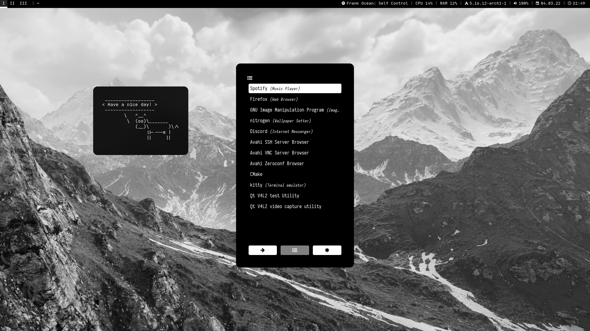
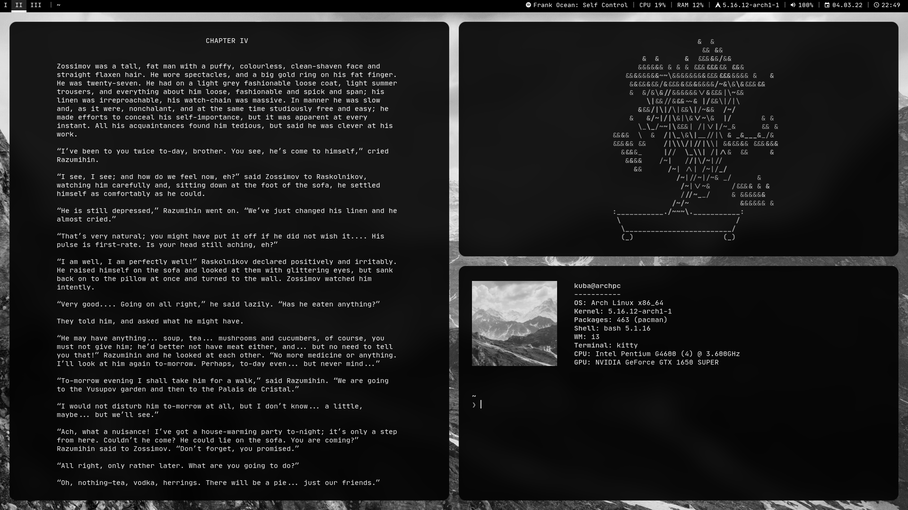

# My dotfiles for Arch Linux v2

Dotfiles are configuration files for various programs, and they help those programs manage their functionality. What sets them apart from regular files and directories is their prefix. Dotfiles are named that way because each file and directory starts with a dot (.) On Unix based systems, dotfiles are hidden by the Operating System by default.
## 
## 
## The programs i use
- **[xorg-xinit](https://archlinux.org/packages/extra/x86_64/xorg-xinit/)**
- **[i3-gaps](https://github.com/Airblader/i3)
- **[Polybar](https://github.com/polybar/polybar)**
- **[Kitty](https://github.com/kovidgoyal/kitty)**
- **bash**
- **[Starship](https://github.com/starship/starship)**
- **Nano**
- **[Rofi](https://github.com/davatorium/rofi)**
- **[Nitrogen](https://archlinux.org/packages/extra/x86_64/nitrogen/)**
- **[ibhagwan Picom fork](https://github.com/ibhagwan/picom)**
# Other
**[Wallpaper](https://www.artstation.com/artwork/QrvZal)**

